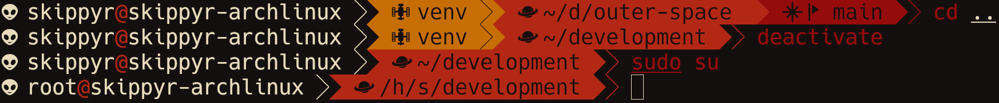

# outer-space
## About
A theme for the ZSH shell with an outer space thematic.


It can show you:
-   Your host and user names.
-   If inside a Git repository, the branch and if there are changes to be commited.
-   Your current directory, abbreaviating parent directories by their initials.

## Installation
### Dependencies
The following dependencies must be installed to install this software properly:
-   `git`
-   A Nerd Font's font.

### Procedures
-   Clone this repository.
```bash
git\
    clone --depth=1 https://github.com/skippyr/outer-space\
    ~/.local/share/zsh/themes/outer-space
```

-   Add the following source rule to your `~/.zshrc` file. Ensure to not source other theme.
```bash
source ~/.local/share/zsh/themes/outer-space/outer-space.zsh-theme
```

-   Reopen ZSH.

## Copyright
This software is under the MIT license. A copy of the license is bundled with the source code.
